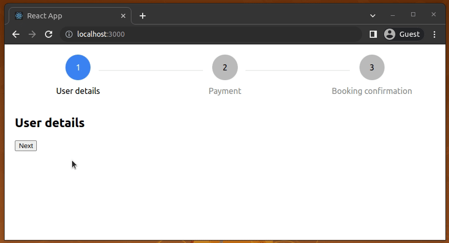

# react-stepper-minimal
A minimal stepper component written in React.js
<br/><br/>


## How to run this project?

- Clone or download the repository.
- Install dependencies:
```bash
npm install
# --- or ---
yarn install
```
- Run the app:
```bash
npm start
# --- or ---
yarn start
```

## License
[MIT](LICENSE)
